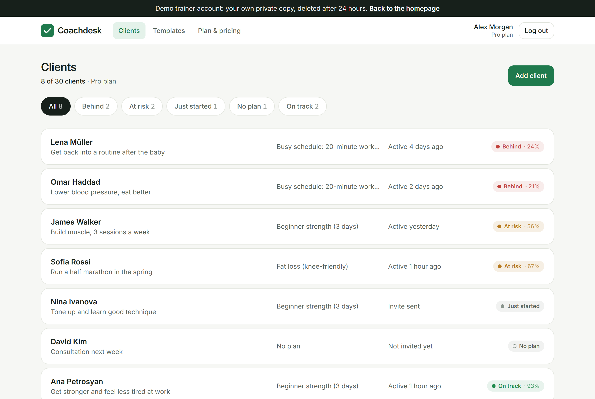
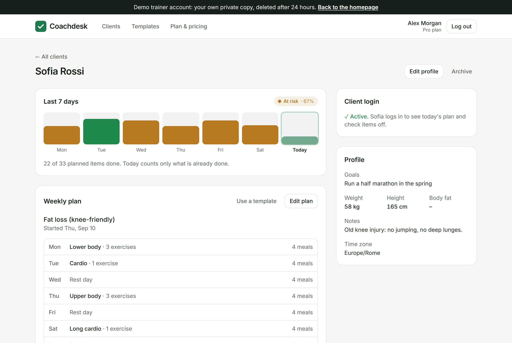
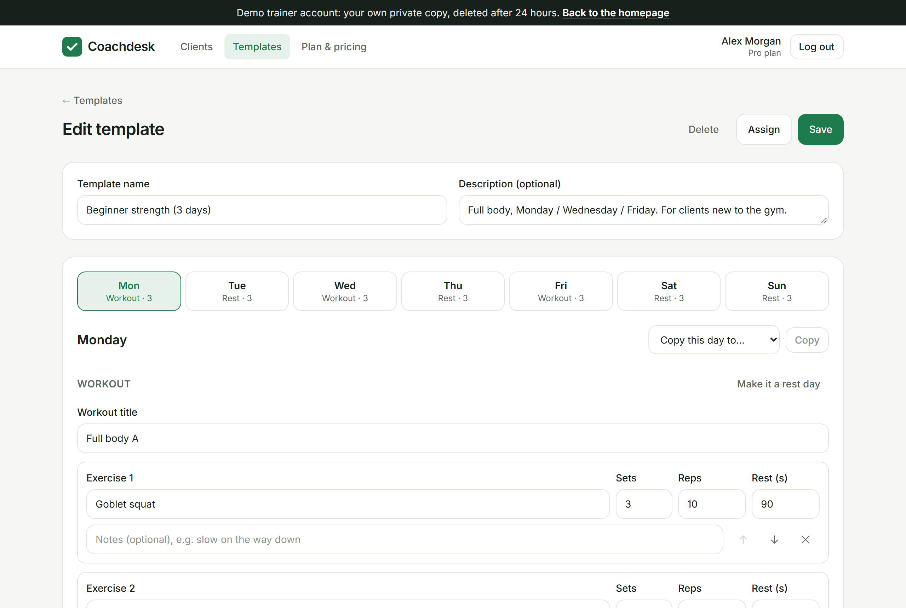
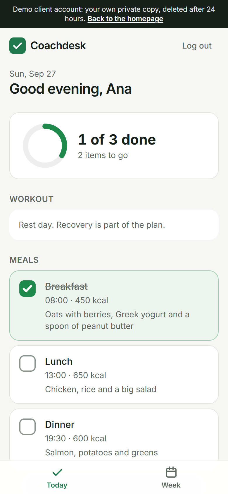
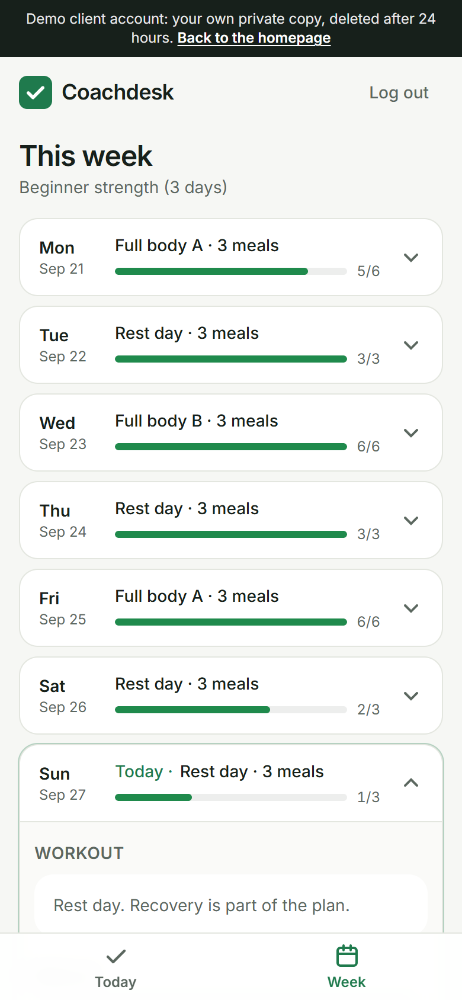
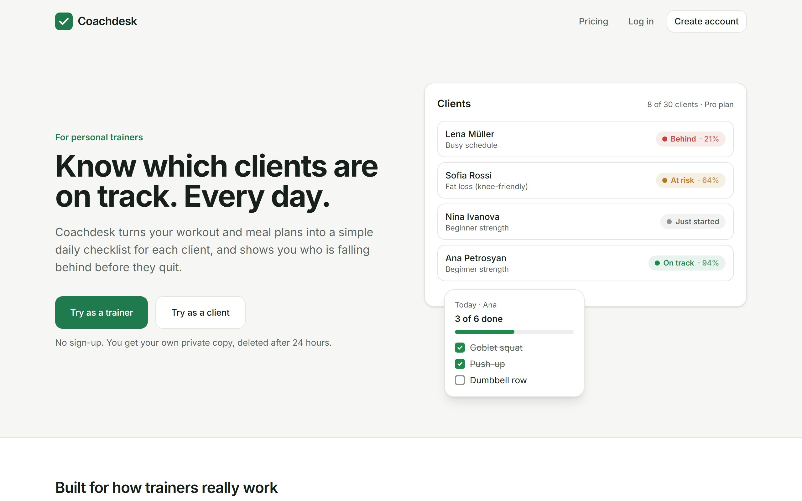
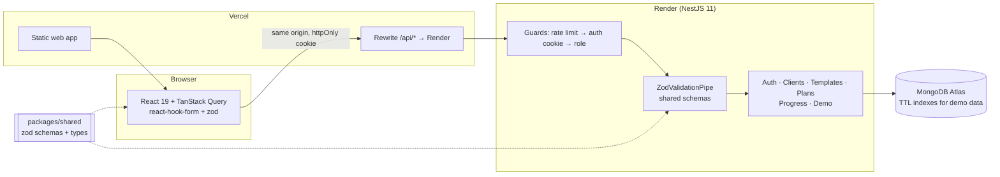

# Coachdesk

**Client management for personal trainers.** Build weekly workout and meal plans, share them with clients through a
one-time invite link, and see on one dashboard who is on track, who is at risk and who is falling behind.

> **Live demo:** _link added after deploy_
>
> Click **Try as a trainer** or **Try as a client**: you get your own private copy of the demo data (8 clients,
> 3 templates, two weeks of history), deleted automatically after 24 hours. The API runs on Render's free tier and
> sleeps when idle, so the first visit can take ~30 s to wake it (the app tells you when this happens).



---

## Highlights

|                                       |                                                                                                                                                                                                         |
| ------------------------------------- | ------------------------------------------------------------------------------------------------------------------------------------------------------------------------------------------------------- |
| **Two roles, real logins**            | Trainers sign up; clients get a one-time **invite link** (send it on WhatsApp, no email service needed). The token is random (256 bit), stored only as a SHA-256 hash, valid for 7 days and single-use. |
| **Cookie auth, one origin**           | JWT in an `httpOnly`, `SameSite=Lax` cookie. Vercel rewrites `/api/*` to the API, so the browser only talks to one origin: first-party cookies, no CORS, no token in localStorage.                      |
| **Data isolation**                    | Every query is scoped by the trainer id from the session, never from the request. Another trainer's client is a **404**, not a 403, so ids don't leak. Tested for every route.                          |
| **Templates are copied**              | Assigning a template makes a **snapshot** for that client. Swap lunges for step-ups for one client's knee without touching the template or anyone else.                                                 |
| **"Today" in the client's time zone** | The server works out each client's calendar date (`Asia/Yerevan`, `America/New_York`, …). Unit tests cover UTC+14, half-hour zones and the daylight-saving switch.                                      |
| **A fair "on track" rule**            | Done ÷ scheduled over the last 7 days: ≥ 80% on track, ≥ 50% at risk, below that behind. Today counts only what's done, so nobody is "behind" at 9 am. One pure function with unit tests.               |
| **Optimistic check-offs**             | The tick shows instantly and rolls back if the request fails. `PUT`/`DELETE` with a unique index make double taps harmless. Only today and yesterday can be changed.                                    |
| **One-call dashboard**                | Every client with status, plan and last activity from a fixed 4 queries, however many clients (no N+1). Sorted so the clients who need attention come first.                                            |
| **Private demo sandboxes**            | Each visitor gets a fresh copy of the demo data. Every document has `expiresAt` and every collection a **TTL index**, so MongoDB deletes it after 24 h: no cleanup job, no shared state.                |
| **One schema, both sides**            | Zod schemas in `packages/shared` validate the web forms _and_ the API (a small `ZodValidationPipe`). Errors come back per field path, so the week editor puts a red dot on the right day.               |
| **Free-tier friendly**                | The app pings the API on load and shows a "Waking up the server…" screen instead of a frozen spinner; the demo button waits for the server before it posts.                                             |

Every backend choice has a short "why" in [`docs/decisions.md`](docs/decisions.md).

## Screenshots

| Client detail                                                                  | Template editor                                                    |
| ------------------------------------------------------------------------------ | ------------------------------------------------------------------ |
|  |  |

| Client: Today (phone)                                 | Client: Week (phone)                               | Landing page                                  |
| ----------------------------------------------------- | -------------------------------------------------- | --------------------------------------------- |
|  |  |  |

## Architecture



**Data model:** `User` (trainer or client) · `Client` (profile, time zone, invite hash) · `Template` (7 days) ·
`ClientPlan` (the client's own copy; one active per client via a partial unique index) · `CheckIn` (unique per
client, date and item).

## API

All routes are under `/api` and need the session cookie unless marked public.

|               | Routes                                                                                                                                                                                                                                                        |
| ------------- | ------------------------------------------------------------------------------------------------------------------------------------------------------------------------------------------------------------------------------------------------------------- |
| Auth (public) | `POST /auth/signup` · `POST /auth/login` · `POST /auth/logout` · `POST /auth/demo` · `GET /auth/invite/:token` · `POST /auth/invite/:token/accept`                                                                                                            |
| Me            | `GET /auth/me` · `PATCH /me/tier` (trainer)                                                                                                                                                                                                                   |
| Trainer       | `GET /dashboard` · `GET/POST /clients` · `GET/PATCH/DELETE /clients/:id` · `POST /clients/:id/invite` · `GET /clients/:id/adherence` · `GET/PUT /clients/:id/plan` · `GET/POST /templates` · `GET/PATCH/DELETE /templates/:id` · `POST /templates/:id/assign` |
| Client        | `GET /me/today` · `GET /me/week` · `PUT/DELETE /me/checkins/:date/:itemId`                                                                                                                                                                                    |
| Health        | `GET /health`                                                                                                                                                                                                                                                 |

## Tech stack

- **Frontend:** React 19, TypeScript, Vite, Tailwind CSS v4, React Router 7, TanStack Query, react-hook-form, zod
- **Backend:** NestJS 11, Mongoose 8, JWT (`@nestjs/jwt`), argon2 (`@node-rs/argon2`), helmet, `@nestjs/throttler`
- **Database:** MongoDB (Atlas M0 in production)
- **Tests:** Jest + supertest on a real in-memory MongoDB (server, 90 tests), Vitest + Testing Library (web, 28 tests)
- **CI:** GitHub Actions runs all tests and the build on every push

## Running locally

Requires Node 20+. No Docker needed.

```bash
npm install
cp apps/server/.env.example apps/server/.env   # then set a long random JWT_SECRET
npm run db:dev      # terminal 1: local MongoDB on :27017 (data kept in apps/server/.dev-db)
npm run dev         # terminal 2: API on :3000, web on :5173
```

Open http://localhost:5173 and click **Try as a trainer**. For fixed local logins, run `npm run seed`
(it prints them, and refuses to run against a non-local database).

| Variable (`apps/server/.env`)                                                       | Purpose                                                                  | Default                 |
| ----------------------------------------------------------------------------------- | ------------------------------------------------------------------------ | ----------------------- |
| `MONGO_URI`                                                                         | MongoDB connection string                                                | _required_              |
| `JWT_SECRET`                                                                        | Signs session tokens (32+ characters in production)                      | _required_              |
| `WEB_ORIGIN`                                                                        | Public web URL, used in invite links; `https://` turns on secure cookies | `http://localhost:5173` |
| `TRUST_PROXY_HOPS`                                                                  | Proxies in front of the API, for real client IPs in rate limits          | `1`                     |
| `RATE_LIMIT_PER_MINUTE` / `AUTH_RATE_LIMIT_PER_MINUTE` / `DEMO_RATE_LIMIT_PER_HOUR` | Per-IP limits                                                            | `120` / `10` / `20`     |

Other scripts: `npm test`, `npm run build`, `npm run format`, `npm run og-image` (link preview image from
`scripts/og-image.svg`), `npm run screenshots` (README screenshots with the installed Chrome, via `puppeteer-core`).

### Tests worth reading

- `progress/adherence.spec.ts` and `progress/dates.spec.ts`: the on-track rule and "today" across time zones
- `clients/clients.e2e.spec.ts`: two trainers, every route, 404s; invite expiry, single use and races
- `templates/templates.e2e.spec.ts`: editing a client's plan never changes the template, and the reverse
- `demo/demo-data.spec.ts`: every demo client shows the same status on any weekday and time of day
- `web/src/test/TodayPage.test.tsx`: the optimistic tick shows before the server answers, and rolls back on error

## Deploying

1. **MongoDB Atlas:** free M0 cluster, copy the connection string.
2. **API on Render:** _New → Blueprint_ on this repo (`render.yaml`). Set `MONGO_URI` and `WEB_ORIGIN`;
   `JWT_SECRET` is generated by Render.
3. **Web on Vercel:** import the repo with **Root Directory** `apps/web` (settings come from `apps/web/vercel.json`,
   including the `/api` rewrite). Set `VITE_SITE_URL` to the Vercel URL for link previews.

## Built with Claude Code

This project was planned and built with [Claude Code](https://claude.com/claude-code) as a pair: I wrote the
product brief and made the decisions (roles, pricing, the on-track rule, the demo sandbox); Claude wrote the code
phase by phase from [`docs/BUILD_PLAN.md`](docs/BUILD_PLAN.md), with tests and a short "why" for every backend
decision in [`docs/decisions.md`](docs/decisions.md). Every phase ended with green CI and a manual check in the browser.

## Project structure

```
packages/shared/        zod schemas and types used by both server and web
apps/server/src/
  auth/                 cookie JWT, guards (auth, roles), argon2, decorators
  clients/              client CRUD, invite links, plan limits
  templates/ plans/     week templates, client plans (snapshot copies)
  progress/             check-ins, today/week, adherence, dashboard
  demo/                 demo data builder, sandbox service, seed script
  common/ config/       ZodValidationPipe, ObjectId pipe, env config
apps/web/src/
  pages/trainer/        dashboard, client detail, template and plan editors
  pages/client/         Today and Week
  components/           UI kit, WeekEditor, wake-up screen, demo buttons
  lib/                  API client, TanStack Query hooks, server status
docs/                   build plan, decisions, screenshots
```

## Known limitations

- Pricing is shown and the client limit is enforced, but there is no payment: switching plans is instant.
- No email: invite links are copied by the trainer (and can be shared on WhatsApp in one click).
- No password reset or account deletion yet.
- The tier limit is checked without a transaction, so two requests at the same moment could both pass.
